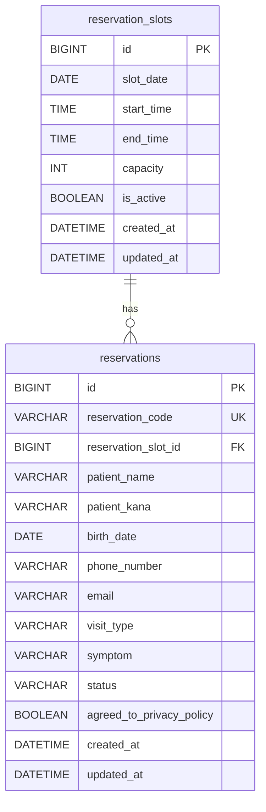

# 佐藤医院 Web予約ページ DB設計書

## 1. 設計方針

本DBは、内科医院Webサイト内のWeb予約ページで使用する。
患者の予約情報、予約可能な時間枠、予約ステータス、初診/再診区分を管理する。

初期開発では、以下を実現することを目的とする。

- 患者がWeb予約フォームから予約できる
- 同一日時の予約上限を超えないようにする
- 管理者が予約一覧・予約詳細を確認できる
- 管理者が予約をキャンセルできる

---

## 2. テーブル一覧

| テーブル名 | 論理名 | 用途 |
|---|---|---|
| `reservation_slots` | 予約枠 | 日付・時間ごとの予約上限数を管理する |
| `reservations` | 予約 | 患者の予約情報を管理する |

---

## 3. テーブル定義

### 3.1 `reservation_slots`：予約枠テーブル

予約可能な日付・時間・定員を管理するテーブル。

| カラム名 | 型 | NULL | キー | デフォルト | 説明 |
|---|---|---|---|---|---|
| `id` | BIGINT | NOT NULL | PK | AUTO_INCREMENT | 予約枠ID |
| `slot_date` | DATE | NOT NULL |  |  | 予約日 |
| `start_time` | TIME | NOT NULL |  |  | 予約開始時間 |
| `end_time` | TIME | NOT NULL |  |  | 予約終了時間 |
| `capacity` | INT | NOT NULL |  | 3 | 予約可能人数 |
| `is_active` | BOOLEAN | NOT NULL |  | TRUE | 予約受付可能フラグ |
| `created_at` | DATETIME | NOT NULL |  | CURRENT_TIMESTAMP | 作成日時 |
| `updated_at` | DATETIME | NOT NULL |  | CURRENT_TIMESTAMP | 更新日時 |

#### 制約

| 制約名 | 内容 |
|---|---|
| PK | `id` |
| UNIQUE | `slot_date`, `start_time` の組み合わせを一意にする |
| CHECK | `capacity >= 0` |
| CHECK | `start_time < end_time` |

---

### 3.2 `reservations`：予約テーブル

患者が登録した予約情報を管理するテーブル。

| カラム名 | 型 | NULL | キー | デフォルト | 説明 |
|---|---|---|---|---|---|
| `id` | BIGINT | NOT NULL | PK | AUTO_INCREMENT | 予約ID |
| `reservation_code` | VARCHAR(20) | NOT NULL | UNIQUE |  | 予約番号 |
| `reservation_slot_id` | BIGINT | NOT NULL | FK |  | 予約枠ID |
| `patient_name` | VARCHAR(50) | NOT NULL |  |  | 氏名 |
| `patient_kana` | VARCHAR(50) | NOT NULL |  |  | フリガナ |
| `birth_date` | DATE | NOT NULL |  |  | 生年月日 |
| `phone_number` | VARCHAR(20) | NOT NULL |  |  | 電話番号 |
| `email` | VARCHAR(255) | NULL |  |  | メールアドレス |
| `visit_type` | VARCHAR(20) | NOT NULL |  |  | 初診/再診区分 |
| `symptom` | VARCHAR(500) | NULL |  |  | 症状 |
| `status` | VARCHAR(20) | NOT NULL |  | `'RESERVED'` | 予約ステータス |
| `agreed_to_privacy_policy` | BOOLEAN | NOT NULL |  | FALSE | 個人情報同意 |
| `created_at` | DATETIME | NOT NULL |  | CURRENT_TIMESTAMP | 作成日時 |
| `updated_at` | DATETIME | NOT NULL |  | CURRENT_TIMESTAMP | 更新日時 |

#### 制約

| 制約名 | 内容 |
|---|---|
| PK | `id` |
| UNIQUE | `reservation_code` |
| FK | `reservation_slot_id` は `reservation_slots.id` を参照 |
| CHECK | `visit_type` は `FIRST`, `RETURN` のいずれか |
| CHECK | `status` は `RESERVED`, `CANCELLED`, `VISITED` のいずれか |
| CHECK | `agreed_to_privacy_policy = TRUE` |

---

## 4. コード値定義

### 4.1 `visit_type`：初診/再診区分

| 値 | 意味 |
|---|---|
| `FIRST` | 初診 |
| `RETURN` | 再診 |

### 4.2 `status`：予約ステータス

| 値 | 意味 |
|---|---|
| `RESERVED` | 予約済み |
| `CANCELLED` | キャンセル済み |
| `VISITED` | 来院済み |

---

## 5. ER図



---

## 6. リレーション定義

| 親テーブル | 子テーブル | 関係 | 内容 |
|---|---|---|---|
| `reservation_slots` | `reservations` | 1対多 | 1つの予約枠に対して複数の予約を登録できる |

### 補足

予約枠の上限チェックは、以下の条件で行う。

```sql
SELECT COUNT(*)
FROM reservations
WHERE reservation_slot_id = ?
  AND status = 'RESERVED';
```

この件数が `reservation_slots.capacity` 未満であれば予約可能とする。

---

## 7. 初期データ

以下は、2026年6月1日から2026年6月3日までの午前診療枠を登録する例である。
各時間帯の予約上限は3名とする。

```sql
INSERT INTO reservation_slots
(slot_date, start_time, end_time, capacity, is_active)
VALUES
('2026-06-01', '09:00:00', '09:30:00', 3, TRUE),
('2026-06-01', '09:30:00', '10:00:00', 3, TRUE),
('2026-06-01', '10:00:00', '10:30:00', 3, TRUE),
('2026-06-01', '10:30:00', '11:00:00', 3, TRUE),
('2026-06-01', '11:00:00', '11:30:00', 3, TRUE),
('2026-06-01', '11:30:00', '12:00:00', 3, TRUE),

('2026-06-02', '09:00:00', '09:30:00', 3, TRUE),
('2026-06-02', '09:30:00', '10:00:00', 3, TRUE),
('2026-06-02', '10:00:00', '10:30:00', 3, TRUE),
('2026-06-02', '10:30:00', '11:00:00', 3, TRUE),
('2026-06-02', '11:00:00', '11:30:00', 3, TRUE),
('2026-06-02', '11:30:00', '12:00:00', 3, TRUE),

('2026-06-03', '09:00:00', '09:30:00', 3, TRUE),
('2026-06-03', '09:30:00', '10:00:00', 3, TRUE),
('2026-06-03', '10:00:00', '10:30:00', 3, TRUE),
('2026-06-03', '10:30:00', '11:00:00', 3, TRUE),
('2026-06-03', '11:00:00', '11:30:00', 3, TRUE),
('2026-06-03', '11:30:00', '12:00:00', 3, TRUE);
```

テスト用予約データの例。

```sql
INSERT INTO reservations
(
  reservation_code,
  reservation_slot_id,
  patient_name,
  patient_kana,
  birth_date,
  phone_number,
  email,
  visit_type,
  symptom,
  status,
  agreed_to_privacy_policy
)
VALUES
(
  'R202606010001',
  1,
  '山田 太郎',
  'ヤマダ タロウ',
  '1985-04-10',
  '090-1234-5678',
  'taro@example.com',
  'FIRST',
  '発熱と喉の痛みがあります。',
  'RESERVED',
  TRUE
),
(
  'R202606010002',
  2,
  '佐藤 花子',
  'サトウ ハナコ',
  '1990-08-20',
  '080-1111-2222',
  'hanako@example.com',
  'RETURN',
  '咳が続いています。',
  'RESERVED',
  TRUE
);
```

---

## 8. CREATE TABLE文

以下はMySQL想定のDDLである。

```sql
CREATE TABLE reservation_slots (
  id BIGINT NOT NULL AUTO_INCREMENT,
  slot_date DATE NOT NULL,
  start_time TIME NOT NULL,
  end_time TIME NOT NULL,
  capacity INT NOT NULL DEFAULT 3,
  is_active BOOLEAN NOT NULL DEFAULT TRUE,
  created_at DATETIME NOT NULL DEFAULT CURRENT_TIMESTAMP,
  updated_at DATETIME NOT NULL DEFAULT CURRENT_TIMESTAMP ON UPDATE CURRENT_TIMESTAMP,
  PRIMARY KEY (id),
  UNIQUE KEY uk_reservation_slots_date_time (slot_date, start_time),
  CHECK (capacity >= 0),
  CHECK (start_time < end_time)
);
```

```sql
CREATE TABLE reservations (
  id BIGINT NOT NULL AUTO_INCREMENT,
  reservation_code VARCHAR(20) NOT NULL,
  reservation_slot_id BIGINT NOT NULL,
  patient_name VARCHAR(50) NOT NULL,
  patient_kana VARCHAR(50) NOT NULL,
  birth_date DATE NOT NULL,
  phone_number VARCHAR(20) NOT NULL,
  email VARCHAR(255) NULL,
  visit_type VARCHAR(20) NOT NULL,
  symptom VARCHAR(500) NULL,
  status VARCHAR(20) NOT NULL DEFAULT 'RESERVED',
  agreed_to_privacy_policy BOOLEAN NOT NULL DEFAULT FALSE,
  created_at DATETIME NOT NULL DEFAULT CURRENT_TIMESTAMP,
  updated_at DATETIME NOT NULL DEFAULT CURRENT_TIMESTAMP ON UPDATE CURRENT_TIMESTAMP,
  PRIMARY KEY (id),
  UNIQUE KEY uk_reservations_reservation_code (reservation_code),
  KEY idx_reservations_slot_status (reservation_slot_id, status),
  KEY idx_reservations_status (status),
  CONSTRAINT fk_reservations_reservation_slot
    FOREIGN KEY (reservation_slot_id)
    REFERENCES reservation_slots (id),
  CHECK (visit_type IN ('FIRST', 'RETURN')),
  CHECK (status IN ('RESERVED', 'CANCELLED', 'VISITED')),
  CHECK (agreed_to_privacy_policy = TRUE)
);
```

---

## 9. 主な検索SQL

### 9.1 指定日の予約可能枠を取得する

```sql
SELECT
  rs.id,
  rs.slot_date,
  rs.start_time,
  rs.end_time,
  rs.capacity,
  rs.capacity - COUNT(r.id) AS remaining
FROM reservation_slots rs
LEFT JOIN reservations r
  ON rs.id = r.reservation_slot_id
  AND r.status = 'RESERVED'
WHERE rs.slot_date = '2026-06-01'
  AND rs.is_active = TRUE
GROUP BY
  rs.id,
  rs.slot_date,
  rs.start_time,
  rs.end_time,
  rs.capacity
ORDER BY rs.start_time;
```

### 9.2 管理者用予約一覧を取得する

```sql
SELECT
  r.id,
  r.reservation_code,
  r.patient_name,
  r.patient_kana,
  r.visit_type,
  rs.slot_date,
  rs.start_time,
  r.status
FROM reservations r
INNER JOIN reservation_slots rs
  ON r.reservation_slot_id = rs.id
WHERE rs.slot_date = '2026-06-01'
ORDER BY rs.start_time, r.id;
```

### 9.3 予約をキャンセルする

```sql
UPDATE reservations
SET
  status = 'CANCELLED',
  updated_at = CURRENT_TIMESTAMP
WHERE id = 1;
```

---

## 10. 今後の拡張案

初期実装後、必要に応じて以下のテーブル追加を検討する。

| テーブル名 | 用途 |
|---|---|
| `admin_users` | 管理者ログイン情報を管理する |
| `departments` | 診療科を管理する |
| `doctors` | 医師情報を管理する |
| `reservation_notifications` | メール通知履歴を管理する |
| `closed_days` | 休診日を管理する |
---

## 11. H2 Console Connection

H2コンソール接続時の設定値は以下の通りです。

- Browser URL: `http://localhost:8080/h2-console`
- JDBC URL: `jdbc:h2:mem:satoclinic`
- User Name: `sa`
- Password: 空欄
